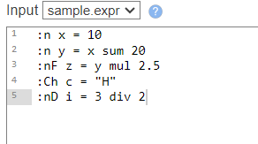
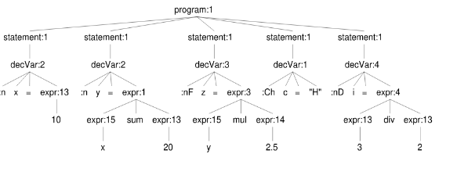
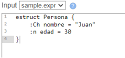
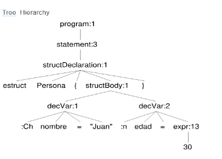
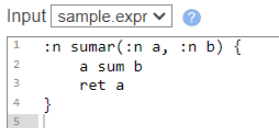
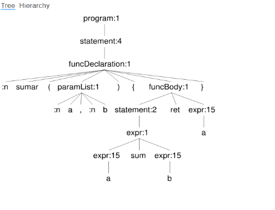
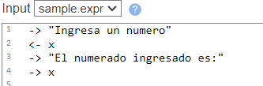
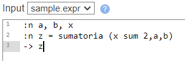
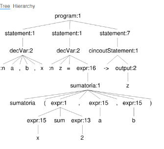

**UNIVERSIDAD PERUANA DE CIENCIAS APLICADAS**

**SECCIÓN: CC61**

**GRUPO:**  

**CURSO: Teoría de compiladores**

**PROFESOR(A):** Jorge Eduardo Díaz Suarez

GRUPO 2

**Trabajo Parcial - Hito 1**

Integrantes: 

Joaquín Eduardo Velarde Leyva          U202212510                                            

Daniel Ivan Carbajal Robles         	 U20221B751                                       

**HITO 1**

**Problemática y motivación:**

El lenguaje de programación C++ tiene algunas problemáticas con respecto a su léxico. Para nuevas personas que están interesados en aprender el lenguaje e introducirse en la programación, se suele dificultar con respecto al léxico que se utiliza dentro del lenguaje mencionado. Además, para el uso de fórmulas matemáticas dentro del lenguaje se tiende a importar librerías, que en diversos casos el individuo se suele olvidar, para que pueda funcionar. 

El desarrollo de un nuevo lenguaje de programación basado en C++ se justifica por las dificultades que enfrentan los principiantes al aprender este lenguaje. Entre los principales desafíos está la complejidad del léxico y la sintaxis de C++, que es conocida por su diversidad de formas para realizar una misma tarea y por las numerosas excepciones a las reglas, lo que puede resultar intimidante y confuso para los nuevos programadores. Además, el manejo manual de memoria, necesario en C++, implica que el programador debe gestionar explícitamente la asignación y liberación de memoria, lo que añade un nivel adicional de complejidad y aumenta el riesgo de cometer errores como fugas de memoria. 

Otro desafío frecuente es el olvido de importar las librerías necesarias para realizar operaciones básicas, como las matemáticas, lo que genera errores difíciles de depurar y aumenta la frustración en los principiantes (Squirrels,2024). La motivación detrás de la creación de un nuevo lenguaje busca enfrentar estas dificultades mediante varias estrategias. En primer lugar, se pretende reducir la complejidad léxica y hacer que la terminología y las estructuras del lenguaje sean más intuitivas y accesibles para los principiantes. En segundo lugar, la incorporación de funciones matemáticas directamente en el lenguaje evitará la dependencia de librerías externas, facilitando el proceso de aprendizaje y reduciendo los errores. Finalmente, se desarrollarán herramientas de apoyo, como un analizador léxico y generadores de árboles sintácticos, que ayudarán a los programadores a comprender mejor la estructura de sus programas, contribuyendo así a una experiencia de aprendizaje más efectiva y menos frustrante (Smith,2024).

**Objetivos:** 

**Objetivo General:**

Desarrollar un nuevo lenguaje de programación basado en C++ que simplifique la sintaxis y el léxico para facilitar el aprendizaje de los principiantes, incorporando funcionalidades matemáticas básicas sin necesidad de librerías externas.

**Objetivos Específicos:**

- Simplificar la terminología y las estructuras del lenguaje para hacerlas más intuitivas y accesibles a los principiantes.
- Implementar un analizador léxico que facilite la comprensión de la estructura del código y reduzca errores.
- Incorporar funciones matemáticas predefinidas dentro del lenguaje, evitando la necesidad de importar librerías externas.
- Reducir la complejidad en la gestión de la memoria para minimizar errores comunes, como las fugas de memoria.
- Implementar un sistema de depuración simple que permita a los usuarios detectar y corregir errores de forma más intuitiva, con mensajes de error claros y sugerencias de soluciones.

**Gramática en ANTLR**

|
grammar parcial;

program

`    `: statement+ ;

statement

`    `: decVar

`    `| expr

`    `| structDeclaration

`    `| funcDeclaration

`    `| for

`    `| ifStatement

`    `| cincoutStatement     // Entrada/salida

`    `| comentario

`    `;

decVar

`    `: VAR\_CHAR ID (ASSIGN STRING)?

`    `| VAR\_INT ID (ASSIGN expr)?

`    `| VAR\_FLOAT ID (ASSIGN expr)?

`    `| VAR\_DOUBLE ID (ASSIGN expr)?

`    `;

expr

`    `: expr PLUS expr      

`    `| expr MINUS expr      

`    `| expr MUL expr        

`    `| expr DIV expr        

`    `| expr MOD expr        

`    `| expr POT expr        

`    `| expr LT expr         

`    `| expr GT expr         

`    `| expr NEQ expr        

`    `| expr ASSIGN expr     

`    `| expr INC             

`    `| LPAREN expr RPAREN   

`    `| NUM

`    `| NUMFLOAT

`    `| ID                  

`    `;

cincoutStatement

`    `: OUTPUT output  // cout

`    `| INPUT input    // cin

`    `;

output

`    `: STRING

`    `| ID

`    `| expr

`    `;

input

`    `: ID

`    `;

structDeclaration

`    `: STRUCT ID LLLAVE structBody RLLAVE

`    `;

structBody

`    `: decVar+

`    `;

funcDeclaration

`    `: VAR\_INT ID LPAREN paramList RPAREN LLLAVE funcBody RLLAVE

`    `;

paramList

`    `: VAR\_INT ID (',' VAR\_INT ID)\*

`    `;

comentario

`    `: COMMENT // Comentario de una línea

`    `;

funcBody

`    `: statement\* RET expr

`    `;

for 

`    `: FOR LPAREN forInit? COMMA forCond? COMMA forUpdate? RPAREN LLLAVE  statement+ RLLAVE

`    `;

forInit

`    `: decVar

`    `| expr

`    `;

forCond

`    `: expr

`    `;

forUpdate

`    `: expr

`    `;

ifStatement

`    `: IF LPAREN expr RPAREN LLLAVE statement+ RLLAVE (ELSE LLLAVE statement+ RLLAVE)?

`    `;

// Lexer rules

WS       : [ \t\r\n]+ -> skip ;           // Ignorar espacios en blanco

PLUS     : 'sum';                         // Suma

MINUS    : 'res';                         // Resta

MUL      : 'mul';                         // Multiplicación

DIV      : 'div';                         // División

MOD      : '%';                           // Modular

POT      : 'pot';                         // Potencia

ASSIGN   : '=';                           // Asignación

INC      : '++';                          // Incremento

LLLAVE   : '{';                           // Llave izquierda

RLLAVE   : '}';                           // Llave derecha

LPAREN   : '(';                           // Paréntesis izquierdo

RPAREN   : ')';                           // Paréntesis derecho

LT       : '<';                           // Menor que

GT       : '>';                           // Mayor que

NEQ      : '<>';                          // Diferente

IF       : 'if';                          // Condicional

ELSE     : 'else';                        // Alternativa

FOR      : 'for';                         // Bucle

RET      : 'ret';                         // Retorno

DEF      : '#def';                        // Define constante

MAX      : 'MAX';                         // Constante MAX

VAR\_INT  : ':n';                          // Variable entera

VAR\_FLOAT: ':nF';                         // Variable float

VAR\_DOUBLE: ':nD';                        // Variable double

VAR\_CHAR : ':Ch';                         // Variable char

VAR\_STR  : ':S';                          // String

VAR\_VOID : ':V';                          // Variable void

STRUCT   : 'estruct';                     // Definición de estructura

COMMENT  : '$' .\*? '\n' -> skip ;         // Comentarios de una línea

OUTPUT   : '->';                          // Equivalente a cout

INPUT    : '<-';                          // Equivalente a cin

COMMA    : ',';                           // Separador de expresiones en el bucle for

NUMFLOAT  : [0-9]'.'[0-9];

ID       : [a-zA-Z][a-zA-Z0-9\_]\* ;        // Identificadores

NUM      : [0-9]+ ;                       // Números enteros

STRING   : '"' .\*? '"' ;                  // Cadenas de texto

|
| :- |

**Ejemplos de input:** 

Declaración de variable:

Declaración de estructura:

Función para la suma de dos números:

Entrada y salida de datos

Función sumatoria

**Bibliografía:**

` `Smith,J.,(Marzo,2024). *Análisis léxico (analizador) en diseño de compilado*r.https://www.guru99.com/es/compiler-design-lexical-analysis.html

Squirrels,J.(Mayo,2024)*¿Qué tan difícil es aprender C++?*.https://codegym.cc/es/forum/1527

